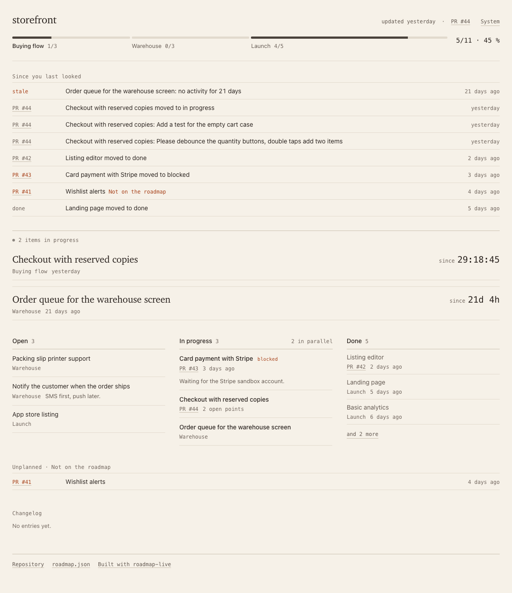

# roadmap-live

Your coding agent keeps a `roadmap.json`. roadmap-live turns it into a page you can look at: a progress bar per milestone, what is being worked on right now, what reviewers still want, and what happened that nobody planned. It works live on your machine while agents work, and it works from GitHub pull requests for a page that stays current without anyone editing it.



No dependencies, no build step. Node 18 or newer.

## Two ways to use it

**Live, while agents work.** Start `npx roadmap-live` in your project. The agent updates `roadmap.json` as it goes; the page at http://localhost:4242 follows without a reload, with a timer on the item in progress and a history of status changes.

**Synced from GitHub pull requests.** Run `npx roadmap-live sync` now and then, or let the included GitHub Action run it on every pull request event. It reads comments, reviews and merges, matches them to the roadmap items, and updates the same file. `npx roadmap-live render` writes a static page from it, ready for GitHub Pages or a link in a chat.

Both views show the same page. The static one has no live parts.

## No API key needed

The matching step ("which item does this pull request belong to") is done by a language model. roadmap-live does not ship one and does not need a key for it. It uses the coding agent you already have, in this order:

1. `ANTHROPIC_API_KEY`, if it is set.
2. Claude Code, if `claude` is installed. Uses your subscription.
3. Codex CLI, if `codex` is installed.
4. Gemini CLI, if `gemini` is installed.
5. None of the above: sync writes what it found into `.roadmap-live/inbox.json`, and your agent classifies it on its next run by following the rule in `AGENTS.md`. Then you run `npx roadmap-live sync --apply`.

Only the GitHub Action needs a key, because nothing else is installed on the runner.

GitHub login works the same way. If you use the GitHub CLI, you are already logged in. Otherwise the first `sync` shows a short code and a link; you confirm in the browser once, and the token is stored in your user folder. `npx roadmap-live doctor` tells you which login and which model would be used, and why.

## Install in three steps

1. In your project folder:

   ```
   npx roadmap-live init
   ```

   This writes `roadmap.json`, `AGENTS.md` and `.github/workflows/roadmap.yml`. Existing files are kept.

2. Tell your agent to read the rules. Codex reads `AGENTS.md` by itself. For Claude Code, add this line to `CLAUDE.md` (create the file if needed); for Cursor, Gemini CLI or Copilot put it in their rules file:

   ```
   Read AGENTS.md and follow its rules for maintaining roadmap.json.
   ```

3. Ask the agent to plan: "Read AGENTS.md. Break the next feature into items in roadmap.json, assign them to milestones and run the check." Then start the page:

   ```
   npx roadmap-live
   ```

For the pull request sync on GitHub, add one secret to the repository: `ANTHROPIC_API_KEY` under Settings, Secrets and variables, Actions. The workflow from step 1 does the rest and commits `roadmap.json`, `roadmap/index.html` and `CHANGELOG.md` when something changed. Turn on GitHub Pages for the `roadmap/` folder if you want a public link.

## Commands

```
npx roadmap-live                       live page for ./roadmap.json on port 4242
npx roadmap-live path/to/roadmap.json  another file
npx roadmap-live --port 5000           another port
npx roadmap-live --check               validate the file, exit code 0 or 1
npx roadmap-live sync                  pull in GitHub activity
npx roadmap-live sync --dry-run        show what sync would change, write nothing
npx roadmap-live sync --repo owner/name
npx roadmap-live render                write roadmap/index.html
npx roadmap-live render --theme paper --out docs/index.html
npx roadmap-live init                  set up a project
npx roadmap-live auth                  log in to GitHub in the browser
npx roadmap-live auth --logout         remove the stored token
npx roadmap-live doctor                explain which login and which model would be used
```

`node roadmap-live.js` works the same if you copied the repository instead of using npx.

## Data format

```json
{
  "project": "abholbereit",
  "theme": "neutral",
  "language": "en",
  "stale_after_days": 7,
  "milestones": [{ "id": "m1", "title": "Ordering flow" }],
  "items": [
    {
      "id": "menu-editor",
      "title": "Menu editor",
      "milestone": "m1",
      "status": "active",
      "note": "optional, one sentence",
      "updated": "2026-09-10T14:02:00Z",
      "branch": "feat/menu-editor",
      "comments": [
        {
          "from": "human",
          "text": "Add a button to clear the menu",
          "at": "2026-09-10T14:00:00Z"
        },
        {
          "from": "agent",
          "text": "Done, button is in the top right.",
          "at": "2026-09-10T14:01:00Z"
        }
      ],
      "question": {
        "text": "Should the delete button require confirmation?",
        "options": ["yes", "no"],
        "asked": "2026-09-10T14:01:30Z"
      },
      "prs": [42],
      "open_points": [
        {
          "text": "Reviewer asked for image size validation",
          "source": "pr:42#comment:1893",
          "opened": "2026-09-10T13:40:00Z",
          "resolved": null
        }
      ]
    }
  ],
  "unplanned": [
    { "title": "Customer loyalty", "prs": [41], "first_seen": "2026-09-08T09:00:00Z" }
  ],
  "sync": { "last_run": "2026-09-10T14:02:00Z", "repo": "marvrue/abholbereit" }
}
```

- The agent writes `project`, `milestones`, `items` with `id`, `title`, `milestone`, `status` (`todo`, `active`, `done`), `note` and `updated`.
- Sync writes `prs`, `open_points`, `unplanned`, `sync` and the status `blocked`. The agent leaves those alone.
- `theme`, `language` and `stale_after_days` are optional settings. Files without them, and files from older versions, work unchanged.
- Milestones are in array order. A milestone is complete when all of its items are done. The current milestone is the first one that is not.
- The human writes `comments` from the page; the agent answers there, sets and clears `question` and records `branch`.

## What "Since you last looked" shows

The block above the board is the short version of what changed, newest first, at most eight rows:

- Status changes, with the pull request that caused them.
- New open points: things a reviewer asked for, in the reviewer's words, so you do not have to open the pull request to know what is holding it up.
- Work that is not on the roadmap, marked as such. It is pulled from pull requests that match no item.
- Items that went quiet: in progress or linked to a pull request, but no activity for `stale_after_days` (default 7).

Quiet, unplanned and blocked share the one attention color on the page. Everything else is gray, so those three are the only things that stand out.

## Talking back to the agent

On the live page every open item can be expanded to a short conversation. Write one sentence ("finish the cart first", "add an item for vouchers") and the agent reads it on its next run, answers in one sentence and acts. When the agent needs a decision it parks a question; those show up in "Waiting for you" above the board with the possible answers as buttons. Everything is stored in `roadmap.json`, so the shared page shows the same conversations, read-only.

The header of the live page also shows where the working copy is: the branch, how many commits it is ahead of `main`, and how many files are changed.

## Themes

Three come built in: `neutral` (default), `paper` (warm, serif headings) and `mono` (everything monospace). Set `"theme": "paper"` in `roadmap.json` or pass `--theme paper` to `render` to pick the default. Every theme has a light and a dark mode; the page follows the system and the toggle in the top right overrides it. Next to it, a second toggle switches between the themes; both choices are remembered in the browser.

To make your own, put `roadmap-themes/<name>.css` in your repository and set `"theme": "<name>"`. A theme is only a list of custom properties; copy `src/page/themes/neutral.css` as a starting point.

## Languages

English by default. The page and the command line switch to German when your system or browser is German. `"language": "de"` in `roadmap.json` or `ROADMAP_LANG=de` fixes it; `?lang=de` on the page overrides everything. Anything without a translation falls back to English. Item titles and notes are your own text and are never translated.

## How sync decides things

- A merged pull request that clearly belongs to an item sets the item to done.
- An open pull request sets the item to in progress. If a reviewer requested changes and nobody approved afterwards, the item shows as blocked.
- An open point is one concrete request from a reviewer. It closes when a later comment or the merge shows it was handled.
- A pull request that matches no item well enough goes to "Not on the roadmap". Sync never creates or deletes items.
- Sync never touches titles, notes, ids or milestones. Running it twice on the same activity changes nothing.
- Every status change adds one line to `CHANGELOG.md` with the date, the item, the change and the pull request.
- The model only sorts. It returns a strict, checked JSON answer. Anything malformed is retried once and then skipped, and the file is only written after every pull request was handled.

## Limits

- One repository per roadmap. Monorepos with several roadmaps need several files and several workflow runs.
- Sync looks at pull requests only, not at issues or commits on main.
- Classification is a judgment call by a language model. Check the plan with `--dry-run` if you want to see it before it writes.
- The browser login needs a public OAuth app; until one is registered for this project, use the GitHub CLI or `GITHUB_TOKEN`.
- The GitHub Action commits to the default branch. Branch protection rules that block the built-in token need a different token in `github_token`.

## License

MIT, see `LICENSE`.

A hosted version, where you paste a repository link and get the page, is planned.
